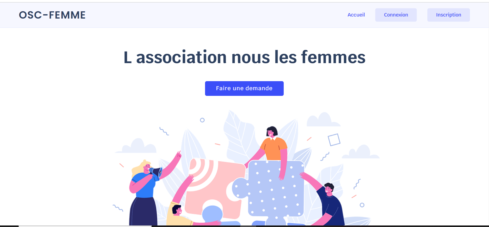

# OSC-FEMME

L'avantage d'utiliser Laravel comme framework est qu'il offre une sécurité de haut niveau. L'utilisation de Laravel sécurise les applications Web, car elle ne permet à aucun malware ou menace de sécurité d'entrer dans les applications. Cela signifie également que votre code de développement Web est sûr et sécurisé

# Gestion de la partie utilisateurs 

